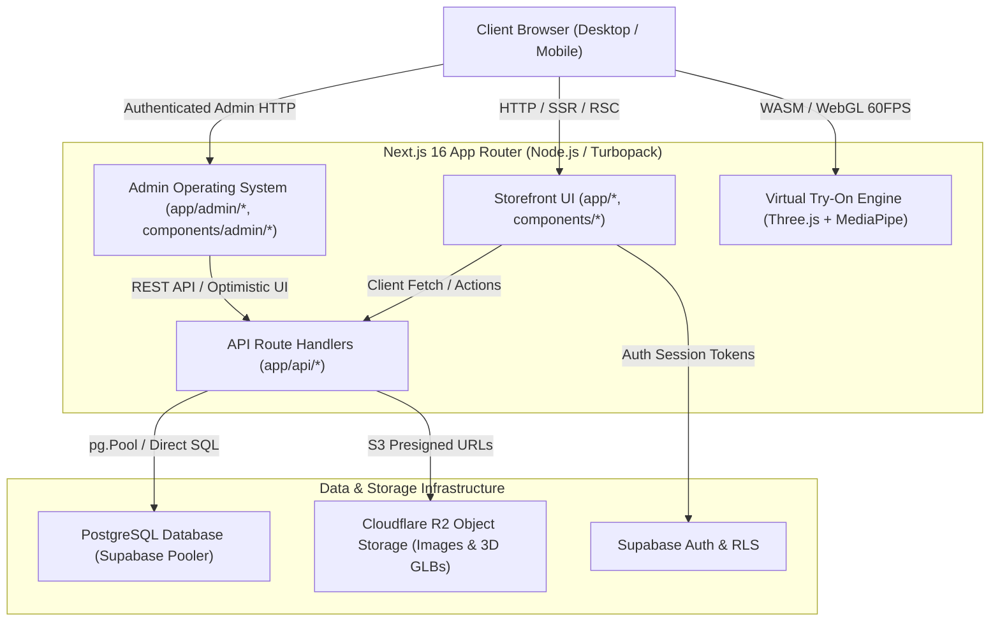
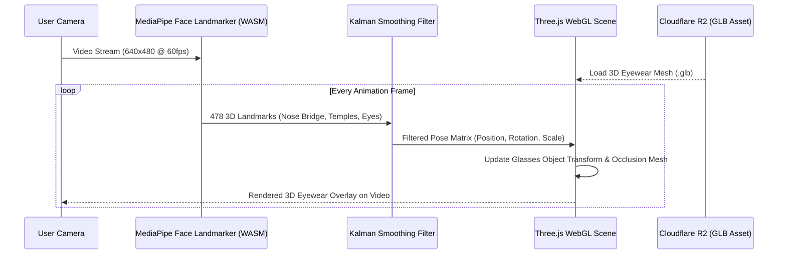

# Precision Optics — System Architecture

This document describes the high-level architecture, directory layout, request lifecycles, and component interaction patterns for the **Precision Optics** platform.

---

## 1. High-Level Architecture Diagram



---

## 2. Layered Architecture

### 2.1. Presentation Layer (UI & Interaction)
- **App Router Pages (`app/`)**: File-system based routing for all customer and admin views.
- **Storefront Components (`components/`)**:
  - `components/home/`: Boutique homepage storytelling sections (Hero slider, Just Dropped, Collectors Edition, Shop by Shape, Shop by Gender, Brand Marquee).
  - `components/shop/`: Product catalog grids, facet filter bars, and card components.
  - `components/product/`: PDP gallery, frame dimensional specs, optical customization trigger.
  - `components/optical/`: Clinical lens package modal (`LensCustomizerModal`) and 3D try-on overlay (`VirtualTryOnModal`).
  - `components/cart/`: Slide-over cart drawer, multi-step checkout modal with address input and payment selection.
  - `components/layout/`: Header with mega-menu, search modal trigger, brand marquee, and luxury footer.
- **Admin OS Components (`components/admin/`)**:
  - `components/admin/layout/`: Persistent desktop sidebar, mobile drawer, executive header with global search modal (Ctrl+K).
  - `components/admin/dashboard/`: KPI metrics cards, real-time lab queues, revenue sales trend chart, recent orders table, urgent restock alerts.
  - `components/admin/products/`: Multi-filter bar, table with inline status toggles, floating bulk action bar, 5-tab eyewear creator/editor.
  - `components/admin/common/`: Standardized status pills (`StatusBadge`), confirmation modals, empty state views.

### 2.2. State Management & React Context Layer (`context/`)
- **`AuthContext.tsx`**: Manages Supabase user sessions, patron profile data, and login/logout state.
- **`CartContext.tsx`**: LocalStorage-persisted cart state with itemized frames, selected lens packages, optical prescription payloads, and coupon calculations.
- **`WishlistContext.tsx`**: Hybrid database/session wishlist synchronization allowing guests and logged-in patrons to bookmark luxury frames.
- **`ToastContext.tsx` / `Sonner`**: Global notification toast system.

### 2.3. API & Backend Route Layer (`app/api/`)
- **Customer Endpoints**:
  - `POST /api/orders`: Validates cart items, verifies stock, records prescription specs, and creates an optical order.
  - `POST /api/appointments`: Schedules in-store clinical eye exam sessions.
  - `POST /api/wishlist`: Toggles frame bookmark for authenticated user or session ID.
  - `POST /api/privacy-requests`: Handles DPDP/GDPR compliant data access or deletion requests.
  - `POST /api/upload`: Generates pre-signed S3 URLs or direct uploads to Cloudflare R2.
- **Admin Endpoints (`app/api/admin/`)**:
  - `GET /api/admin/dashboard`: Computes gross turnover, order counts, lab status breakdowns, and daily sales history with dynamic time-range filtering (`today`, `7d`, `30d`, `this_month`).
  - `GET/POST /api/admin/products`, `GET/PUT/PATCH/DELETE /api/admin/products/[id]`: Full CRUD with SKU variant updates and Cloudflare R2 media sync.
  - `GET/PATCH /api/admin/orders/[id]`: Manages optical lab stepper stage, courier partner, tracking number, and retrieves OD/OS specs.
  - `GET /api/admin/customers`: Aggregates customer lifetime value (LTV), total order history, and latest prescription records.
  - `GET/PATCH /api/admin/inventory`: SKU-level stock inspection and inline increment/decrement delta adjustments.
  - `GET/POST/DELETE /api/admin/categories`, `GET/POST/DELETE /api/admin/brands`, `GET/POST/DELETE /api/admin/coupons`.
  - `GET/PUT /api/admin/settings`: Universal JSON settings storage (`general`, `payments`, `shipping`, `content`, `loyalty`, `roles`).

### 2.4. Data Access Layer (`lib/`)
- **`lib/adminDb.ts`**: Direct PostgreSQL connection pool (`pg.Pool`) via `DATABASE_URL` for high-throughput, latency-free server-side operations and administrative queries.
- **`lib/db.ts`**: Shared SQL query helpers with transaction handling and error wrappers.
- **`lib/supabase.ts`**: `@supabase/supabase-js` client configured for client-side Auth and RLS-scoped user queries.
- **`lib/productsService.ts`**: High-performance catalog query service with local fallbacks to ensure zero layout shift during database maintenance.
- **`lib/r2.ts`**: Cloudflare R2 S3 SDK client (`@aws-sdk/client-s3`) configured with presigners for secure, fast media uploads.

---

## 3. Directory Layout

```
precision-opticals/
├── AGENTS.md                   # Mandatory developer & agent rules
├── ARCHITECTURE.md             # Project architecture specification
├── TRY_ON_DATA_MODEL.md        # 3D Try-On data model documentation
├── app/                        # Next.js 16 App Router
│   ├── (storefront pages)      # /, /about, /cart, /privacy, etc.
│   ├── admin/                  # Admin panel routes (/admin, /admin/products, etc.)
│   ├── api/                    # API route handlers (/api/admin/*, /api/orders, etc.)
│   ├── layout.tsx              # Root HTML layout, font injection, SW cleanser
│   └── globals.css             # Tailwind CSS v4 design tokens & base rules
├── components/                 # React UI components
│   ├── admin/                  # Admin panel components (dashboard, products, layout)
│   ├── cart/                   # Cart drawer, checkout modal, order success
│   ├── home/                   # Boutique homepage showcase sections
│   ├── optical/                # Lens customizer & Virtual Try-On modals
│   ├── shop/                   # Catalog filter bar, product grid, card
│   ├── try-on/                 # 3D calibration overlay, camera permission UI
│   └── ui/                     # Primitives (button, dialog, input, etc.)
├── context/                    # Auth, Cart, Wishlist, Toast context providers
├── docs/                       # Comprehensive documentation suite
│   ├── overview.md             # High-level overview & business domain
│   ├── architecture.md         # System architecture & data flow (this file)
│   ├── tech_stack.md           # Dependencies, libraries, and toolchains
│   ├── database_schema.md      # Detailed PostgreSQL table schemas & RLS
│   └── virtual-try-on/         # Specialized 3D VTO documentation
├── lib/                        # Server & client utility libraries
│   ├── adminDb.ts              # Server pg.Pool database connection
│   ├── db.ts                   # Core database query utilities
│   ├── productsService.ts      # Product retrieval service & fallbacks
│   ├── r2.ts                   # Cloudflare R2 S3 client
│   ├── supabase.ts             # Supabase client initialization
│   ├── try-on/                 # VTO math, Kalman filters, model loaders
│   └── utils.ts                # cn, formatCurrency, string helpers
├── public/                     # Static assets (favicons, fonts, fallback images, 3D GLBs)
├── scripts/                    # Database migrations, seeders, sync utilities
├── supabase/                   # Supabase migration SQL definitions
│   └── migrations/             # 01_initial, 02_wishlist, 03_privacy, 04_try_on
└── types/                      # TypeScript definitions (index.ts, tryOn.ts)
```

---

## 4. Virtual Try-On (VTO) 3D Pipeline



---

## 5. Security & Isolation Model

1. **Server-Side Isolation**: All database mutations and sensitive credentials (masked Stripe/Razorpay keys, PostgreSQL pool) are executed strictly in server-side API routes or Server Components.
2. **Row Level Security (RLS)**: Public tables (`products`, `categories`, `brands`) permit public `SELECT`. Sensitive user tables (`orders`, `prescriptions`, `customer_addresses`, `profiles`) require verified `auth.uid() = user_id` or `public.is_admin() = true`.
3. **Admin DB Pool**: Direct server pooling via `lib/adminDb.ts` allows admin endpoints to aggregate company-wide metrics without client token spoofing.
4. **Service Worker Cleanser**: Automatic deregistration script in `app/layout.tsx` guarantees no conflicting offline Service Workers can intercept routing.
