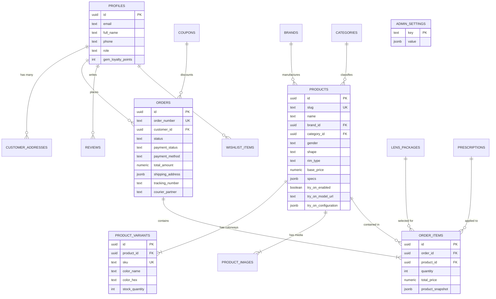

# Precision Optics — Database Schema & Data Models

This document provides complete documentation of the PostgreSQL database schema, data types, constraints, indexes, triggers, and Row Level Security (RLS) policies for the **Precision Optics** platform.

---

## 1. Entity-Relationship (ER) Diagram



---

## 2. Table Specifications

### 2.1. `public.profiles`
Extends Supabase `auth.users` with patron profiles and loyalty points.
```sql
CREATE TABLE public.profiles (
  id UUID PRIMARY KEY REFERENCES auth.users(id) ON DELETE CASCADE,
  full_name TEXT,
  email TEXT UNIQUE NOT NULL,
  phone TEXT,
  role TEXT NOT NULL DEFAULT 'customer' CHECK (role IN ('customer', 'admin', 'optician')),
  gem_loyalty_points INTEGER NOT NULL DEFAULT 0,
  avatar_url TEXT,
  created_at TIMESTAMPTZ NOT NULL DEFAULT NOW(),
  updated_at TIMESTAMPTZ NOT NULL DEFAULT NOW()
);
```

### 2.2. `public.customer_addresses`
Postal and delivery locations for registered patrons.
```sql
CREATE TABLE public.customer_addresses (
  id UUID PRIMARY KEY DEFAULT gen_random_uuid(),
  user_id UUID NOT NULL REFERENCES public.profiles(id) ON DELETE CASCADE,
  full_name TEXT NOT NULL,
  phone TEXT NOT NULL,
  street_address TEXT NOT NULL,
  city TEXT NOT NULL,
  state TEXT NOT NULL,
  pincode TEXT NOT NULL,
  country TEXT NOT NULL DEFAULT 'India',
  is_default BOOLEAN NOT NULL DEFAULT false,
  created_at TIMESTAMPTZ NOT NULL DEFAULT NOW(),
  updated_at TIMESTAMPTZ NOT NULL DEFAULT NOW()
);
```

### 2.3. `public.categories`
Eyewear taxonomy (e.g., Eyeglasses, Sunglasses, Screen Glasses).
```sql
CREATE TABLE public.categories (
  id UUID PRIMARY KEY DEFAULT gen_random_uuid(),
  slug TEXT UNIQUE NOT NULL,
  name TEXT NOT NULL,
  description TEXT,
  image_url TEXT,
  display_order INTEGER NOT NULL DEFAULT 0,
  is_active BOOLEAN NOT NULL DEFAULT true,
  created_at TIMESTAMPTZ NOT NULL DEFAULT NOW(),
  updated_at TIMESTAMPTZ NOT NULL DEFAULT NOW()
);
```

### 2.4. `public.brands`
Luxury design houses and manufacturers (Cartier, Maybach, GAST, Lindberg, etc.).
```sql
CREATE TABLE public.brands (
  id UUID PRIMARY KEY DEFAULT gen_random_uuid(),
  slug TEXT UNIQUE NOT NULL,
  name TEXT NOT NULL,
  origin TEXT,
  tagline TEXT,
  logo_url TEXT,
  featured_image_url TEXT,
  description TEXT,
  is_featured BOOLEAN NOT NULL DEFAULT false,
  is_active BOOLEAN NOT NULL DEFAULT true,
  created_at TIMESTAMPTZ NOT NULL DEFAULT NOW(),
  updated_at TIMESTAMPTZ NOT NULL DEFAULT NOW()
);
```

### 2.5. `public.products`
Master catalog table containing luxury eyewear specifications and 3D configuration.
```sql
CREATE TABLE public.products (
  id UUID PRIMARY KEY DEFAULT gen_random_uuid(),
  slug TEXT UNIQUE NOT NULL,
  name TEXT NOT NULL,
  subtitle TEXT,
  brand_id UUID REFERENCES public.brands(id) ON DELETE SET NULL,
  category_id UUID REFERENCES public.categories(id) ON DELETE SET NULL,
  gender TEXT NOT NULL CHECK (gender IN ('men', 'women', 'unisex', 'kids')),
  shape TEXT NOT NULL CHECK (shape IN ('aviator', 'cat-eye', 'rectangle', 'round', 'square', 'geometric', 'oval', 'wayfarer')),
  rim_type TEXT NOT NULL CHECK (rim_type IN ('full-rim', 'half-rim', 'rimless', 'semi-rimless')),
  material TEXT NOT NULL,
  color TEXT NOT NULL,
  color_hex TEXT NOT NULL,
  base_price NUMERIC(10,2) NOT NULL CHECK (base_price >= 0),
  original_price NUMERIC(10,2) CHECK (original_price >= base_price),
  lens_properties TEXT[] NOT NULL DEFAULT '{}',
  specs JSONB NOT NULL DEFAULT '{"lensWidth": 52, "bridgeWidth": 18, "templeLength": 145, "frameWidth": 140, "weight": "24g"}',
  description TEXT,
  is_new_arrival BOOLEAN NOT NULL DEFAULT false,
  is_best_seller BOOLEAN NOT NULL DEFAULT false,
  is_on_sale BOOLEAN NOT NULL DEFAULT false,
  is_limited_edition BOOLEAN NOT NULL DEFAULT false,
  is_active BOOLEAN NOT NULL DEFAULT true,
  rating NUMERIC(3,2) NOT NULL DEFAULT 5.00,
  review_count INTEGER NOT NULL DEFAULT 0,
  try_on_enabled BOOLEAN NOT NULL DEFAULT false,
  try_on_model_url TEXT,
  try_on_configuration JSONB DEFAULT '{"modelVersion":1,"scaleMultiplier":1.0,"verticalOffset":-0.008,"depthOffset":0.015,"frameWidth":140}',
  created_at TIMESTAMPTZ NOT NULL DEFAULT NOW(),
  updated_at TIMESTAMPTZ NOT NULL DEFAULT NOW()
);
```

### 2.6. `public.product_variants`
SKU-level colorway variations with stock inventory allocation.
```sql
CREATE TABLE public.product_variants (
  id UUID PRIMARY KEY DEFAULT gen_random_uuid(),
  product_id UUID NOT NULL REFERENCES public.products(id) ON DELETE CASCADE,
  color_name TEXT NOT NULL,
  color_hex TEXT NOT NULL,
  sku TEXT UNIQUE NOT NULL,
  stock_quantity INTEGER NOT NULL DEFAULT 10 CHECK (stock_quantity >= 0),
  price_override NUMERIC(10,2),
  is_default BOOLEAN NOT NULL DEFAULT false,
  created_at TIMESTAMPTZ NOT NULL DEFAULT NOW(),
  updated_at TIMESTAMPTZ NOT NULL DEFAULT NOW()
);
```

### 2.7. `public.product_images`
Product photo galleries hosted on Cloudflare R2 CDN.
```sql
CREATE TABLE public.product_images (
  id UUID PRIMARY KEY DEFAULT gen_random_uuid(),
  product_id UUID NOT NULL REFERENCES public.products(id) ON DELETE CASCADE,
  variant_id UUID REFERENCES public.product_variants(id) ON DELETE SET NULL,
  url TEXT NOT NULL,
  alt_text TEXT,
  display_order INTEGER NOT NULL DEFAULT 0,
  is_primary BOOLEAN NOT NULL DEFAULT false,
  created_at TIMESTAMPTZ NOT NULL DEFAULT NOW()
);
```

### 2.8. `public.lens_packages`
Catalog of prescription and non-prescription optical lens packages.
```sql
CREATE TABLE public.lens_packages (
  id UUID PRIMARY KEY DEFAULT gen_random_uuid(),
  lens_type TEXT NOT NULL CHECK (lens_type IN ('single-vision', 'progressive', 'zero-power-blue', 'frame-only')),
  name TEXT NOT NULL,
  description TEXT,
  price NUMERIC(10,2) NOT NULL DEFAULT 0.00 CHECK (price >= 0),
  badge TEXT,
  is_active BOOLEAN NOT NULL DEFAULT true,
  display_order INTEGER NOT NULL DEFAULT 0,
  created_at TIMESTAMPTZ NOT NULL DEFAULT NOW()
);
```

### 2.9. `public.prescriptions`
Stored clinical eye power parameters.
```sql
CREATE TABLE public.prescriptions (
  id UUID PRIMARY KEY DEFAULT gen_random_uuid(),
  user_id UUID REFERENCES auth.users(id) ON DELETE SET NULL,
  patient_name TEXT NOT NULL,
  doctor_name TEXT,
  rx_date DATE,
  right_eye JSONB NOT NULL DEFAULT '{"sph": "0.00", "cyl": "0.00", "axis": "0", "add": null}',
  left_eye JSONB NOT NULL DEFAULT '{"sph": "0.00", "cyl": "0.00", "axis": "0", "add": null}',
  pd NUMERIC(4,1) NOT NULL DEFAULT 63.0,
  file_url TEXT,
  created_at TIMESTAMPTZ NOT NULL DEFAULT NOW()
);
```

### 2.10. `public.orders`
Master optical orders containing status, financial ledger, and logistics information.
```sql
CREATE TABLE public.orders (
  id UUID PRIMARY KEY DEFAULT gen_random_uuid(),
  order_number TEXT UNIQUE NOT NULL,
  customer_id UUID REFERENCES public.profiles(id) ON DELETE SET NULL,
  guest_email TEXT,
  guest_phone TEXT,
  status TEXT NOT NULL DEFAULT 'confirmed' CHECK (status IN ('confirmed', 'optician_assembly', 'quality_check', 'dispatched', 'delivered', 'cancelled')),
  payment_status TEXT NOT NULL DEFAULT 'unpaid' CHECK (payment_status IN ('unpaid', 'paid', 'failed', 'refunded')),
  payment_method TEXT NOT NULL CHECK (payment_method IN ('upi', 'card', 'netbanking', 'cod')),
  subtotal NUMERIC(10,2) NOT NULL CHECK (subtotal >= 0),
  discount_amount NUMERIC(10,2) NOT NULL DEFAULT 0.00 CHECK (discount_amount >= 0),
  coupon_code TEXT,
  shipping_fee NUMERIC(10,2) NOT NULL DEFAULT 0.00 CHECK (shipping_fee >= 0),
  total_amount NUMERIC(10,2) NOT NULL CHECK (total_amount >= 0),
  shipping_address JSONB NOT NULL,
  tracking_number TEXT NOT NULL,
  courier_partner TEXT DEFAULT 'BlueDart Express',
  estimated_delivery DATE,
  created_at TIMESTAMPTZ NOT NULL DEFAULT NOW(),
  updated_at TIMESTAMPTZ NOT NULL DEFAULT NOW()
);
```

### 2.11. `public.order_items`
Itemized lines in an order including frame, lens package, and historical product snapshot.
```sql
CREATE TABLE public.order_items (
  id UUID PRIMARY KEY DEFAULT gen_random_uuid(),
  order_id UUID NOT NULL REFERENCES public.orders(id) ON DELETE CASCADE,
  product_id UUID REFERENCES public.products(id) ON DELETE SET NULL,
  variant_id UUID REFERENCES public.product_variants(id) ON DELETE SET NULL,
  lens_package_id UUID REFERENCES public.lens_packages(id) ON DELETE SET NULL,
  prescription_id UUID REFERENCES public.prescriptions(id) ON DELETE SET NULL,
  quantity INTEGER NOT NULL DEFAULT 1 CHECK (quantity > 0),
  unit_price NUMERIC(10,2) NOT NULL CHECK (unit_price >= 0),
  lens_price NUMERIC(10,2) NOT NULL DEFAULT 0.00 CHECK (lens_price >= 0),
  total_price NUMERIC(10,2) NOT NULL CHECK (total_price >= 0),
  product_snapshot JSONB NOT NULL,
  created_at TIMESTAMPTZ NOT NULL DEFAULT NOW()
);
```

### 2.12. `public.appointments`
Clinical eye examination and boutique consultation bookings.
```sql
CREATE TABLE public.appointments (
  id UUID PRIMARY KEY DEFAULT gen_random_uuid(),
  booking_reference TEXT UNIQUE NOT NULL,
  patient_name TEXT NOT NULL,
  patient_phone TEXT NOT NULL,
  patient_email TEXT NOT NULL,
  service TEXT NOT NULL,
  store_location TEXT NOT NULL,
  appointment_date DATE NOT NULL,
  time_slot TEXT NOT NULL,
  status TEXT NOT NULL DEFAULT 'scheduled' CHECK (status IN ('scheduled', 'confirmed', 'completed', 'cancelled', 'no_show')),
  notes TEXT,
  created_at TIMESTAMPTZ NOT NULL DEFAULT NOW(),
  updated_at TIMESTAMPTZ NOT NULL DEFAULT NOW()
);
```

### 2.13. `public.coupons`
Privilege discount codes and cart conditions.
```sql
CREATE TABLE public.coupons (
  id UUID PRIMARY KEY DEFAULT gen_random_uuid(),
  code TEXT UNIQUE NOT NULL,
  discount_type TEXT NOT NULL CHECK (discount_type IN ('percentage', 'fixed')),
  discount_value NUMERIC(10,2) NOT NULL CHECK (discount_value > 0),
  min_order_value NUMERIC(10,2) DEFAULT 0.00,
  max_discount NUMERIC(10,2),
  valid_from TIMESTAMPTZ NOT NULL DEFAULT NOW(),
  valid_until TIMESTAMPTZ NOT NULL,
  usage_limit INTEGER DEFAULT 500,
  used_count INTEGER NOT NULL DEFAULT 0,
  is_active BOOLEAN NOT NULL DEFAULT true,
  created_at TIMESTAMPTZ NOT NULL DEFAULT NOW()
);
```

### 2.14. `public.wishlist_items`
User & session-based product bookmarks.
```sql
CREATE TABLE public.wishlist_items (
  id UUID PRIMARY KEY DEFAULT gen_random_uuid(),
  user_id UUID REFERENCES public.profiles(id) ON DELETE CASCADE,
  session_id TEXT,
  product_id TEXT NOT NULL,
  created_at TIMESTAMPTZ NOT NULL DEFAULT NOW(),
  updated_at TIMESTAMPTZ NOT NULL DEFAULT NOW()
);
```

### 2.15. `public.privacy_requests`
DPDP / GDPR data privacy inquiries and deletion requests.
```sql
CREATE TABLE public.privacy_requests (
  id UUID PRIMARY KEY DEFAULT gen_random_uuid(),
  request_type TEXT NOT NULL CHECK (request_type IN ('access_data', 'delete_data', 'opt_out_marketing', 'rectify_data', 'other')),
  full_name TEXT NOT NULL,
  email TEXT NOT NULL,
  phone TEXT,
  details TEXT,
  status TEXT NOT NULL DEFAULT 'pending' CHECK (status IN ('pending', 'processing', 'completed', 'rejected')),
  created_at TIMESTAMPTZ NOT NULL DEFAULT NOW(),
  updated_at TIMESTAMPTZ NOT NULL DEFAULT NOW()
);
```

### 2.16. `public.admin_settings`
Universal configuration store for payments, shipping, editorial content, and staff roles.
```sql
CREATE TABLE public.admin_settings (
  key TEXT PRIMARY KEY,
  value JSONB NOT NULL,
  updated_at TIMESTAMPTZ NOT NULL DEFAULT NOW()
);
```

---

## 3. Database Triggers & Helper Functions

### 3.1. Auto Update `updated_at`
```sql
CREATE OR REPLACE FUNCTION public.update_updated_at_column()
RETURNS TRIGGER AS $$
BEGIN
  NEW.updated_at = NOW();
  RETURN NEW;
END;
$$ LANGUAGE plpgsql;
```

### 3.2. Admin Authorization Check
```sql
CREATE OR REPLACE FUNCTION public.is_admin()
RETURNS BOOLEAN AS $$
BEGIN
  RETURN EXISTS (
    SELECT 1 FROM public.profiles
    WHERE id = auth.uid() AND role = 'admin'
  );
END;
$$ LANGUAGE plpgsql SECURITY DEFINER;
```

---

## 4. Row Level Security (RLS) Policy Summary

| Table | Public Access (`anon`) | Authenticated User (`customer`) | Admin (`is_admin()`) |
|---|---|---|---|
| `profiles` | None | Read/Update own profile | Read/Update all |
| `customer_addresses` | None | CRUD own addresses | Read all |
| `categories` / `brands` | `SELECT` active | `SELECT` active | Full CRUD |
| `products` / `variants` / `images` | `SELECT` active | `SELECT` active | Full CRUD |
| `lens_packages` | `SELECT` active | `SELECT` active | Full CRUD |
| `prescriptions` | None | Read/Insert own | Read all |
| `orders` / `order_items` | `INSERT` (guest checkout) | Read own orders | Full CRUD |
| `appointments` | `INSERT` (book exam) | Read own bookings | Full CRUD |
| `wishlist_items` | Read/Insert/Delete by `session_id` | Read/Insert/Delete by `user_id` | Full Read |
| `privacy_requests` | `INSERT` | Read own by email | Full CRUD |
| `admin_settings` | None (server-side direct pool only) | None | Full CRUD via backend |
